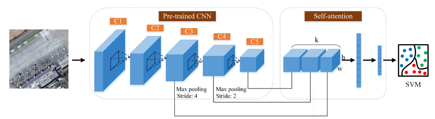
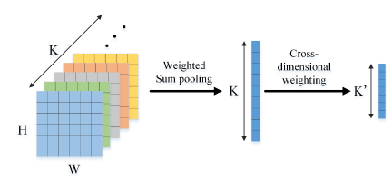

# Self-Attention-Based Deep Feature Fusion for Remote Sensing Scene Classification
使用vgg16和SAFF做小样本分类

## 介绍
* 使用经过预训练后的vgg16提取数据集特征


* SAFF把特征转换成 1D 张量



## 准备
```bash
conda create -n zh python=3.9
conda activate zh
python3 -m pip install --upgrade pip
pip3 install -r requirements.txt
```

## 运行
假如数据集在 */hy-tmp/data*
假设此时要训练 *UC* 数据集。

* 提取特征
```
python run.py 
--data_path /hy-tmp/data 
--extract
--dataset UC
```

* 训练+验证

```
python run.py 
--data_path /hy-tmp/data
--train
--dataset UC
--ratio 0.8
```

## 实验结果

| dataset | train_ratio |  acc  |
|:-------:|:-----------:|:-----:|
|  NWPU   |     0.1     | 66.49 |
|  NWPU   |     0.2     | 73.13 |
|   UC    |     0.8     | 92.5  |
|   SAR   |     0.8     | 89.8  |